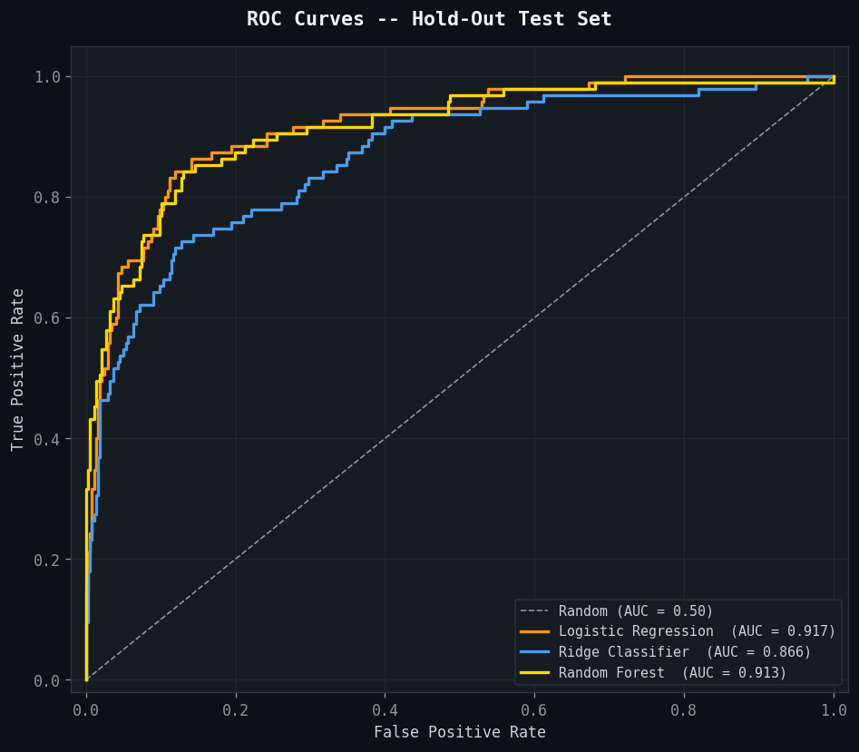

# Market Risk Prediction System

A fully reproducible, End-to-end machine learning system for predicting Bitcoin market risk with strong out-of-sample performance and rigorous time-series validation using multi-asset data from January 2017 to February 2026.

---

## Overview

This project predicts whether next-day Bitcoin volatility will enter a **high-risk** or **low-risk** state using daily price data from four assets: Bitcoin (BTC), S&P 500, Gold Futures, and the VIX. The pipeline is built around strict financial ML standards -- no data leakage, time-series aware validation, and rigorous statistical inference.

### What makes this different from typical ML on financial data

Most ML projects on financial time series cut corners in ways that inflate results. This project addresses them explicitly:

- **Expanding median target construction** instead of a global median, which leaks future distribution information into training labels
- **Cross-asset ratio features lagged by 1 day** so no same-day closing price enters the feature set before the signal is generated
- **Diebold-Mariano test** instead of a Welch t-test for comparing forecast accuracy on dependent time-series data
- **CalibratedClassifierCV on Ridge** instead of min-max normalised decision scores, so ROC-AUC is comparable across all models
- **Walk-forward validation** across 8 expanding windows to assess real deployment stability
- **Risk-adjusted passive baseline** in the trading simulation that matches the model's average BTC exposure

---

## 🚀 Key Takeaways

- Achieved strong predictive performance with ROC-AUC of 0.917 on unseen data
- Demonstrated robust discrimination across 8 walk-forward windows (mean AUC 0.92)
- Identified volatility clustering as the dominant driver of market risk
- Showed that strong predictive signals do not always translate to profitability under trending regimes

## Results

### Model Performance (Hold-Out Test Set, 471 observations)

| Model | CV AUC | CV Std | Accuracy | Precision | Recall | F1 | ROC AUC | Brier |
|---|---|---|---|---|---|---|---|---|
| **Logistic Regression** | 0.8705 | 0.0717 | 0.8854 | 0.7253 | 0.6947 | 0.7097 | **0.9172** | **0.1014** |
| Ridge Classifier | 0.7953 | 0.1034 | 0.8556 | 0.6484 | 0.6211 | 0.6344 | 0.8662 | 0.1587 |
| Random Forest | **0.9222** | **0.0131** | **0.8917** | **0.8438** | 0.5684 | 0.6792 | 0.9132 | 0.0995 |
| Baseline (Persistence) | n/a | n/a | 0.9002 | 0.7500 | 0.7579 | 0.7539 | n/a | n/a |

**Best model by test ROC-AUC: Logistic Regression (0.9172)**

Logistic Regression wins on ROC-AUC (0.9172) and produces the best-calibrated probability estimates (Brier 0.1014). Random Forest leads on cross-validation AUC (0.9222) with the tightest CV variance (±0.013), suggesting more stable generalisation across folds. Ridge lags on every metric and is the most volatile in both CV and walk-forward results.

The baseline accuracy of 0.9002 looks high because volatility regimes cluster -- predicting yesterday's label is a strong strategy. The ML models trade some accuracy against the baseline in exchange for meaningfully better probability discrimination, as reflected in the ROC-AUC.

### Classification Report - Logistic Regression

```
               precision    recall  f1-score   support

 Low Risk (0)       0.92      0.93      0.93       376
High Risk (1)       0.73      0.69      0.71        95

     accuracy                           0.89       471
    macro avg       0.82      0.81      0.82       471
 weighted avg       0.88      0.89      0.88       471
```

The model identifies low-risk days reliably (93% recall) and catches about 69% of high-risk days. The test window (2022-2026) included extended low-volatility stretches where high-risk days were genuinely rare (as low as 10% of observations in some walk-forward windows), which makes high-risk recall inherently harder.

### Statistical Significance (Diebold-Mariano Test)

| Model | DM Statistic | p-value | Significant? |
|---|---|---|---|
| Logistic Regression | -0.1439 | 0.8856 | No |
| Ridge Classifier | -3.9926 | 0.0001 | Yes |
| Random Forest | +0.0298 | 0.9762 | No |

The DM test uses a Newey-West HAC variance estimator (bandwidth=8) -- the correct approach for dependent time-series forecasts, unlike a Welch t-test which assumes independence.

Ridge is the only model that is statistically significantly different from the baseline, and in the wrong direction: its probability forecasts are worse than the naive baseline. Logistic Regression and Random Forest do not show statistically significant improvement in probability accuracy over the baseline (p = 0.886 and p = 0.976). This coexists with their strong ROC-AUC because discrimination and calibrated accuracy measure different things. A model can rank predictions correctly (high AUC) without its probabilities being more accurate in absolute terms than a simpler rule.

### Walk-Forward Validation (8 Expanding Windows, 147 observations each)

| Model | Mean AUC | Std | Min | Max |
|---|---|---|---|---|
| Logistic Regression | 0.9238 | 0.0297 | 0.8934 | 0.9616 |
| Random Forest | 0.9181 | 0.0244 | 0.8895 | 0.9687 |
| Ridge Classifier | 0.8812 | 0.0623 | 0.7677 | 0.9549 |

Walk-forward AUC is consistently strong for Logistic Regression and Random Forest across all eight windows covering 2021-2026. Ridge is more volatile -- its minimum of 0.77 in window 1 (Aug 2021-Mar 2022, 57% high-risk days) shows it struggles under class imbalance, consistent with its lack of `class_weight` support. The tighter variance in Random Forest (0.024 vs 0.030 for LR) suggests slightly more stable behaviour over deployment-like conditions.

### Feature Importance

`btc_vol_7d` (7-day BTC realised volatility) dominates both attribution methods:

| Feature | MDI | Permutation (mean AUC drop) |
|---|---|---|
| btc_vol_7d | 0.4413 | +0.1305 |
| btc_vol_30d | 0.1154 | +0.0132 |
| btc_ret_lag1 | 0.0405 | +0.0127 |
| btc_ret | 0.0371 | +0.0072 |
| btc_mom7 | 0.0371 | +0.0026 |

The MDI value of 0.441 triggered the dominance warning (threshold: 0.30). Permutation importance on the test set confirmed it is genuinely predictive -- shuffling it causes a 0.130 drop in AUC, ten times larger than the next feature. This is not an MDI artefact. Volatility clustering is one of the most reliable empirical patterns in finance, and the results reflect that directly.

### Trading Simulation (Test Period, Zero Transaction Costs)

| Strategy | Ann. Return | Ann. Volatility | Sharpe | Max Drawdown | Days Invested |
|---|---|---|---|---|---|
| Buy and Hold (100% BTC) | +6.66% | 46.92% | 0.14 | -49.74% | 470 |
| Model (Logistic Regression) | -7.79% | 33.74% | -0.23 | -42.40% | 379 |
| Passive (81% BTC, risk-adjusted) | +5.37% | 37.85% | 0.14 | -42.59% | 470 |
| Baseline (Persistence) | -20.61% | 33.26% | -0.62 | -49.75% | 375 |

The trading simulation highlights a critical real-world insight: 
accurate risk prediction does not guarantee profitability.

During sustained bull markets, volatility-based risk signals can 
lead to reduced exposure and missed upside, resulting in lower returns 
despite strong predictive performance.

This demonstrates the importance of aligning model objectives 
with trading strategy design.



---

## Project Structure

```
market-risk-prediction/
├── market_risk_prediction.ipynb   # Main notebook
├── requirements.txt               # Python dependencies
├── .gitignore
├── README.md
├── data/
│   ├── raw_prices.csv             # Auto-generated (~204 KB)
│   └── features.csv               # Auto-generated (~1.5 MB)
└── results/
    ├── all_results.txt            # Full plain-text results summary (~4.5 KB)
    ├── all_results.xlsx           # Structured Excel workbook, 5 sheets (~11.7 KB)
    ├── model_results.csv
    ├── walk_forward_results.csv
    ├── classification_report.txt
    └── figures/                   # 11 PNG figures
```

---

## Pipeline

| # | Description |
|---|---|
| 1 | Data ingestion via `yfinance` (BTC, SP500, Gold, VIX -- Jan 2017 to Feb 2026) |
| 2 | Preprocessing: business-day alignment, forward-fill (max 3 days), NaN removal |
| 3 | Feature engineering: 34 features across returns, volatility, momentum, lags, cross-asset ratios (lagged 1 day) |
| 4 | Chronological 80/20 train/test split, no shuffling |
| 5 | Model training: Logistic Regression, Ridge (CalibratedClassifierCV), Random Forest |
| 6 | Evaluation: Accuracy, Precision, Recall, F1, ROC-AUC, Brier Score |
| 7 | Diebold-Mariano test (Newey-West HAC, bandwidth=8) |
| 8 | Feature attribution: MDI vs permutation importance (n_repeats=20, test set) |
| 9 | Walk-forward validation (8 expanding windows, 147 obs per test block) |
| 10 | Trading simulation with risk-adjusted passive baseline |
| 11 | 11 figures saved to `results/figures/` |
| 12 | Results exported to `results/all_results.txt` and `results/all_results.xlsx` |

---

## Feature Engineering

| Feature Group | Features | Notes |
|---|---|---|
| Daily log-returns | `btc_ret`, `sp500_ret`, `gold_ret`, `vix_ret` | Standard log-return formula |
| Rolling volatility (annualised) | `btc_vol_7d`, `btc_vol_30d`, `sp500_vol_7d`, `sp500_vol_30d`, `vix_vol_7d`, `vix_vol_30d` | sqrt(252) annualisation |
| Momentum | `btc_mom7`, `btc_mom30`, `sp500_mom7`, `sp500_mom30` | price / rolling MA - 1 |
| Lagged returns | `btc_ret_lag1` to `lag5`, `sp500_ret_lag1` to `lag3` | Short-term autocorrelation |
| Lagged VIX levels | `vix_lag1`, `vix_lag2`, `vix_lag3` | Fear indicator history |
| Cross-asset ratios | `btc_sp500_ratio_lag1`, `btc_gold_ratio_lag1`, `sp500_gold_ratio_lag1` | Lagged 1 day to avoid execution ambiguity |
| VIX signals | `vix_level_lag1`, `vix_change`, `vix_zscore` | Level, spike detection, normalised reading |
| Regime signal | `btc_sp500_corr30` | Rolling 30-day return correlation |

**Target variable:** Binary indicator for whether next-day BTC 7-day realised volatility exceeds the expanding historical median. Leak-free by construction.

---

## Installation

```bash
git clone [https://github.com/mikechuksanalyst/market-risk-prediction.git]
cd market-risk-prediction
pip install -r requirements.txt
jupyter notebook market_risk_prediction.ipynb
```

### Requirements

- `yfinance >= 0.2.0`
- `scikit-learn >= 1.3.0`
- `pandas >= 2.0.0`
- `numpy >= 1.24.0`
- `scipy >= 1.10.0`
- `matplotlib >= 3.7.0`
- `seaborn >= 0.12.0`
- `openpyxl >= 3.1.0`

---

## Limitations

- **No transaction costs:** the trading simulation assumes zero spread, zero commission, and instant execution. Real deployment costs would reduce or eliminate the apparent signal.
- **Execution timing:** a production system would compute the signal at close and execute at the next open, not at the same close.
- **Non-stationarity:** the 2023-2024 BTC bull run in the test window is a structural regime where risk-avoidance strategies naturally underperform directionally. Walk-forward retraining would be required in production.
- **Single binary target:** the model predicts only whether next-day volatility is above or below the historical median -- not magnitude, direction, or multi-day drawdown.
- **DM test result:** Logistic Regression and Random Forest do not show statistically significant improvement over the naive baseline in probability forecast accuracy. Strong ROC-AUC and a non-significant DM test can coexist when a model discriminates well in rank-order but does not produce more accurate probabilities in absolute terms.

---

## References

- Diebold, F.X. and Mariano, R.S. (1995). "Comparing Predictive Accuracy." Journal of Business and Economic Statistics, 13(3), 253-263.
- Strobl, C., Boulesteix, A.L., Zeileis, A., and Hothorn, T. (2007). "Bias in random forest variable importance measures." BMC Bioinformatics, 8(25).
- Breiman, L. (2001). "Random Forests." Machine Learning, 45(1), 5-32.
- Platt, J. (1999). "Probabilistic outputs for support vector machines." Advances in Large Margin Classifiers.

---

## License

MIT License. See LICENSE for details.
